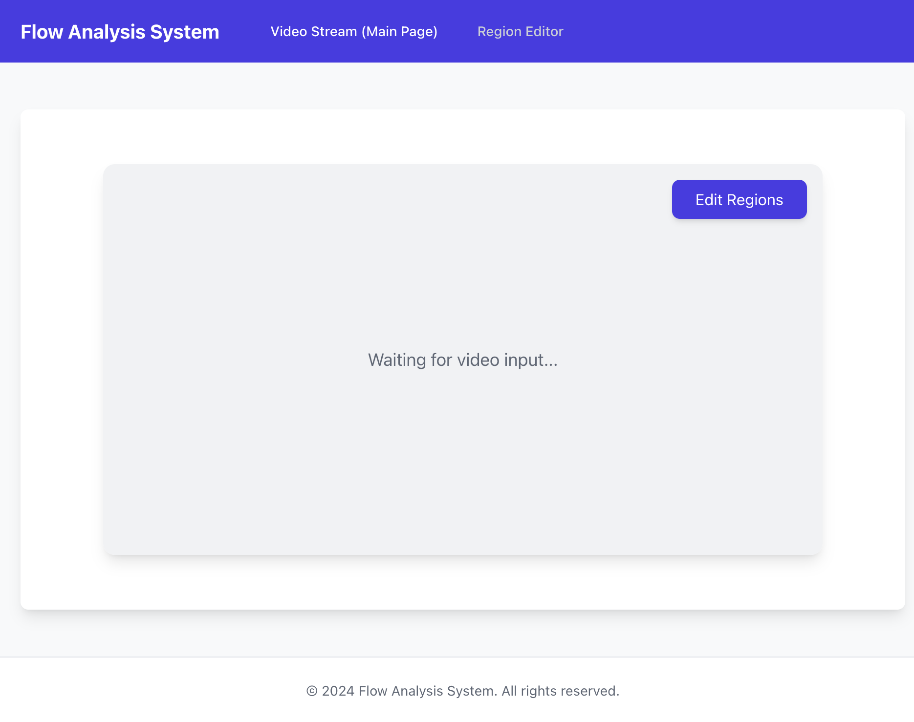
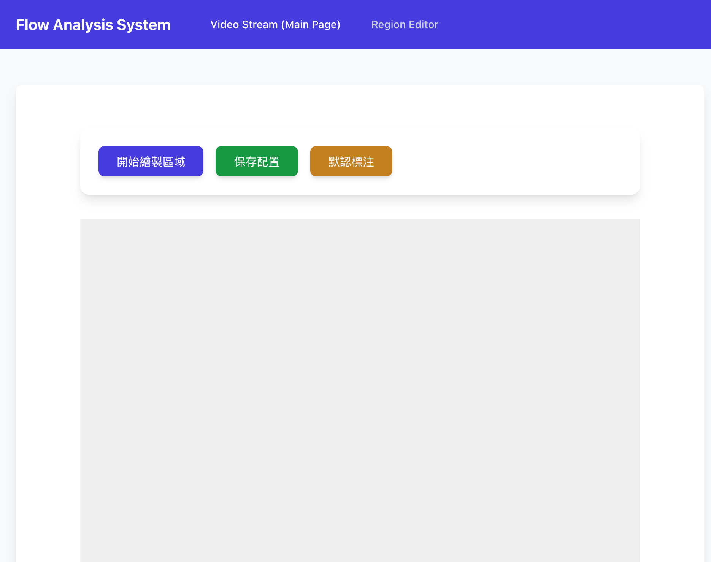

# Flow Analysis System

## Getting Started

### Installation
1. Clone the repository:
   ```bash
   git clone <repository-url>
   ```
2. Navigate into the project directory:
   ```bash
   cd flow-analysis-system
   ```
3. Install dependencies:
   ```bash
   npm install
   ```

### Running the Application
To start the application in development mode, run:
```bash
npm start
```
The application will launch in development mode and open in your default browser at `http://localhost:3000`.

## Project Structure
- `src/`: Source code directory
  - `components/`: Contains reusable React components.
  - `pages/`: Contains page-level components for routing.
  - `services/`: Contains API and data service functions.
  - `utils/`: Contains utility functions and helpers.
  - `assets/`: Contains static assets like images and styles.

## Available Scripts
- `npm start`: Runs the app in development mode.
- `npm run build`: Builds the app for production.
- `npm test`: Launches the test runner.
- `npm run eject`: Removes the single build dependency (use with caution).


## Screenshots
### Main Dashboard


### Region Editor
